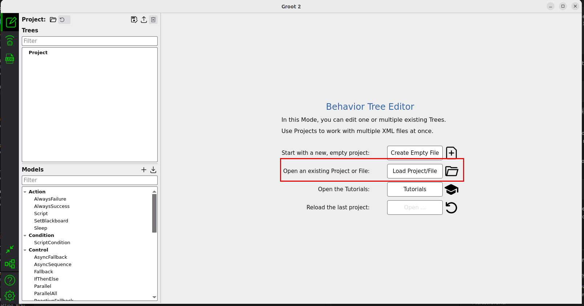
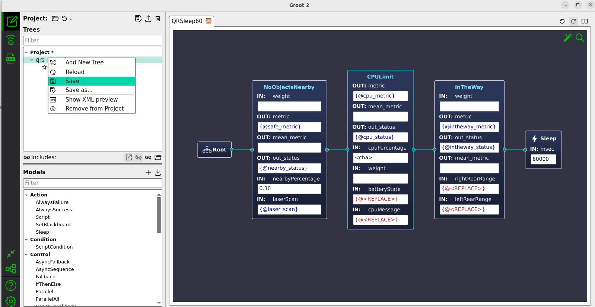

**************************
Self-Adaptation with Mirte
**************************

Welcome to the self-adaptation exercises.  
Now that you know a little bit about self-adaptation, it is time to put it into practice with your Mirte Master robot.
These exercises revolve around the four phases of the MAPE-K loop (Monitoring, Analysis, Planning, and Execution).
This will be implemented in the ReBeT (**Re**-configuration with **Be**\ havior **T**\ rees) framework.

Getting Started
===============
We are using the same image as for with PDDL.
However, the run command has been modified slightly.
Please use the following commands to run the a container:

1. First allow xhost

.. code-block:: bash
    
   xhost +

2. And then the container

.. code-block:: bash
    
   docker run -it --rm --name mirte -e DISPLAY=$DISPLAY -e QT_X11_NO_MITSHM=1 -v /dev/dri:/dev/dri -v /tmp/.X11-unix:/tmp/.X11-unix -v /etc/localtime:/etc/localtime:ro --network host --cap-add SYS_ADMIN --device /dev/fuse --security-opt apparmor:unconfined ghcr.io/kas-lab/mirte_playground:main

I recommend using Visual studio code to connect to the running container.
You need to install the dev containers extension and then use the command palette (in View menu) for the action 'Attach to running container'.

You can then open the ``mirte_ws`` folder inside the container.

Monitoring
==========

Robots like the Mirte Master produce lots of information.
Mirte specifically publishes many ROS2 topics for you to consider in a self-adaptive system's monitoring.
We specifically want to monitor information that tells us something about the current state of Mirte with regard to the quality attributes, like performance or safety, which matter to us.

System Reflection
-----------------

The system reflection node places data into the blackboard used by the nodes in the behavior tree.
You can find its implementation in the ``src/rebet_mirte/rebet_school/scripts/system_reflection.py`` file.

1. Add subscribers for the following topics:
    - ``/io/distance/rear_left``
    - ``/io/distance/rear_right``
    - ``/io/power/power_watcher``
    - ``/diagnostics``

.. note::

   You can use the ROS2 command line interface to figure out the types of each of these topics to create the correct subscribers.

.. warning::

   The ``/diagnostics`` topic is used for publishing lots of different data.
   In the callback for this subscriber, you need to grab the key-value pair corresponding to the ``Load Average (1 min)``.
   You are, of course, welcome to look at the other key-value pairs and choose to add more of these into the blackboard if you think they may be useful for analysis.

2. Ensure the messages received by the subscribers are placed in the blackboard using the appropriate client.
Keep in mind you will need the names you choose for the blackboard entries later on.

For both of these steps, the subscriber to the LaserScan topic serves as an example of what is expected.

**Checking your work**: To see if you have done everything correctly, run the following command on a computer connected to Mirte, but inside:

.. code-block:: bash

   ros2 launch rebet_school bringup_rebet_mirte.launch.py exercise:=monitoring

If you only want to check that your new subscribers are working, before bothering with the blackboard you can of course run the system reflection node in isolation like this:

.. code-block:: bash

   ros2 run rebet_school system_reflection.py

You should see the ``mirte_arborist`` terminal outputting the contents of the blackboard.

.. note::
   The output may be a bit messy.
   You can uncomment line 28 in ``rebet_school/launch/arborist_config_launch.py`` to make a separate terminal for the blackboard contents.

Analysis
========

Analysis uses the information obtained during monitoring to determine if an adaptation is necessary.
The necessity for adaptation is typically described through adaptation goals.
In ReBeT, adaptation goals are expressed through quality requirements.
For example, a safety quality requirement might be not to collide with any objects.

ReBeT allows you to express quality requirements through a special kind of decorator node called a **QRDecorator**.
These requirements express a constraint placed on the behavior tree nodes below them in the tree.

In the ``rebet_school/include/quality_requirements.hpp`` file, you will find three QRDecorators declared.
However, only the first one, ``NoObjectsNearbyQR``, is fully implemented.
This QR corresponds to the quality requirement: *There shall be no objects within X percent of the lidar range of the robot*, with X being a threshold that can be specified through an input port to the quality requirement.

1. Implement the ``calculate_measure`` method of ``InTheWayQR``.
The corresponding natural language quality requirement is: *The robot shall not pose an obstacle to humans standing behind it*.
All the required input ports have already been declared for you.
You can follow the example in ``NoObjectsNearbyQR``.

2. Implement the ``calculate_measure`` method of ``CPULimitQR``.
The corresponding natural language quality requirement is: *The robot's average CPU load over the last minute should never exceed X%*, where X is specified through an input port.

3. (Optional) Incorporate the ``BatteryState`` message's information into an extension of the ``CPULimitQR``.
For example, you can add an *or* condition related to the number of watts consumed by the robot.

.. warning::
   
   Not all the data required for calculating a measure may be available at the exact same time, or in the most up-to-date state.
   Please account for this in your implementation to prevent crashes.
   Additionally, not all data types always contain data.
   For example, the Mirte's sonar/lidar sensors simply return 'null' as a range when there is nothing within their range.

Before you can check your work, you need to fill in some missing details in the behavior tree specification using your QRs.
You can use the following command to open Groot2, an IDE for behavior trees:

.. code-block:: bash

   ~/mirte_ws/groot.AppImage

Within Groot, use the 'Load Project/File' button to open the file ``src/rebet_school/trees/qrs_sleep``.
You should now see a behavior tree containing the three quality decorators you just worked on.

.. 

4. Wherever you see ``<REPLACE>``, replace the string with the name for the corresponding blackboard entry you chose when completing step 2 of the Monitoring exercise.
You should just set all the weights to 1, they are not used.
You can save your work by right-clicking the entries in the Project tree on the left.

.. 

**Checking your work**: To see if you have done everything correctly, run the following command on a computer connected to Mirte, in the container:

.. code-block:: bash

   ros2 launch rebet_school bringup_rebet_mirte.launch.py exercise:=analysis

You should see entries in the blackboard corresponding to what is output by your QRDecorators.
Depending on your chosen thresholds, you can watch as the status of your QRs change by, for example, putting your hand in front of Mirte's rear sonar sensors.

Planning
========

Now that we know the quality requirements the system should fulfill, we should plan some adaptations to keep them satisfied at runtime.  
Within ReBeT, this is accomplished with a special kind of decorator node called an **AdaptDecorator**.
These decorators contain a ROS2 node which is configured to adapt the software architecture of a ROS2 system.
To do so, it makes use of a corresponding adaptation layer which processes requests from the AdaptDecorators and makes corresponding adaptations to ROS2 nodes, such as changing their parameters.

In the ``rebet_school/include/adapt_navtopose.hpp`` file, you will find three AdaptDecorators declared.
These three AdaptDecorators are specifically meant for changing nodes related to the Nav2 NavigateToPose action.
We have pre-defined three methods: ``decrease_max_velocity()``, ``increase_max_velocity()``, and ``change_path_planner(PathPlanner)``.
``SimpleAdaptMaxVelocity`` has been implemented already to demonstrate how AdaptDecorators work.

1. Complete the implementation of ``ComplexAdaptMaxVelocity``.
This can be done by finishing the ``evaluate_condition()`` method.
This method triggers any adaptations, through the three methods mentioned prior, when it returns true.
Each of the three methods returns a boolean; they should return true as long as the adaptation is feasible.
Changing to a maximum velocity lower than 0.0 would, for example, return false.
For ``ComplexAdaptMaxVelocity``, make an adaptation plan which considers the data from each of the three InputPorts, the status and metric of the Nearby QR, and the status of the InTheWay QR from the previous exercises.

2. Complete the implementation of ``AdaptPlanner``.
You can assume we know from experimentation that SMAC uses more CPU than NavFn.

3. (Optional) Also adjust the maximum velocity based on the CPU Usage status.
You can add a metric defined in the CPU QR to the InputPorts and in the corresponding QR's implementation to make more fine-grained adaptation logic.

Execution
=========

The actual execution of adaptations as described in MAPE-K is already taken care of by the adaptation layer.
Instead, in this exercise, you should design a behavior tree using all the new nodes you have just defined, as well as the ``NavigateToPose`` BTActionNode which has already been defined for you.

Once again, you can open Groot as follows:

.. code-block:: bash

   ~/mirte_ws/groot.AppImage

.. tip::

   You can open multiple terminals into the docker container using the ``docker exec -it mirte_playground bash`` command in your system's terminal.

This, open the ``adap_qrs.xml`` file adjacent to the other trees from before.
In the menu on the bottom left, you can select various BT nodes, including those you have just been defining.

.. warning::

   If you added new ports to or changed existing ports of your decorators at any point, please ask Elvin to help you adjust the files to work with Groot properly.

1. Define a new tree (right-click in the project view on the left) which makes use of multiple ``NavigateToPose`` actions and the decorator nodes in tandem.
The ``action_name`` port for ``NavigateToPose`` is ``navigate_to_pose``.
The format for poses is interpreted as the xyz of the position followed by the xyzw of the rotation.
You should separate the parts by semicolons like this: ``-8.0;1.7;0;0;0;0;0;``.

We recommend adding a Sleep action node of a few seconds as the first in your tree, to give you time to make sure everything is ready before the tree starts executing.
Run the following command:

.. code-block:: bash

   ros2 launch rebet_school bringup_rebet_mirte.launch.py exercise:=execution

You will notice that Groot also opens.
Instead of using it for editing, we will be using it to monitor the tree.
Press the robot icon at the top left, input the port number 1667, and then press Connect.
You should see the tree you made (keep in mind it needs to have been started) in action.
